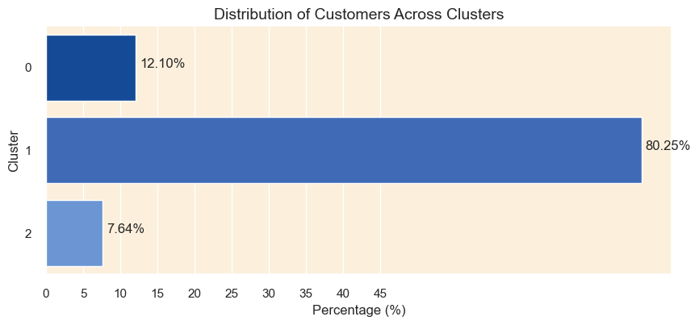
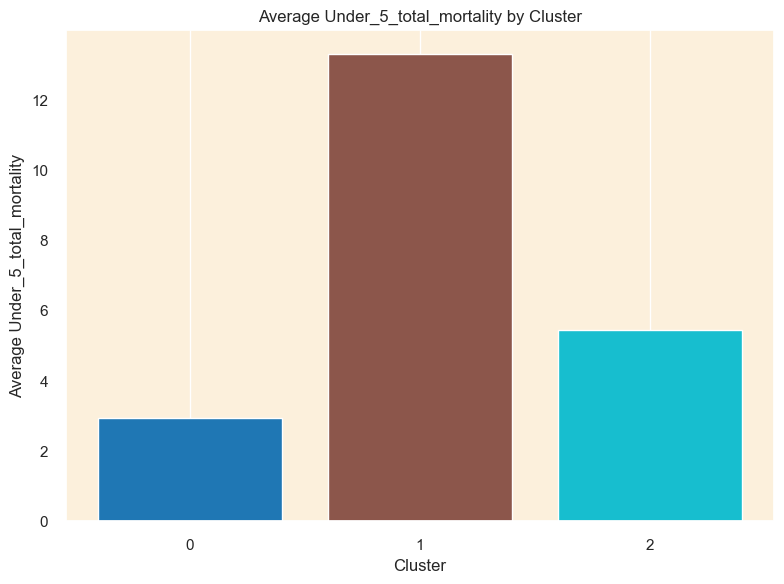
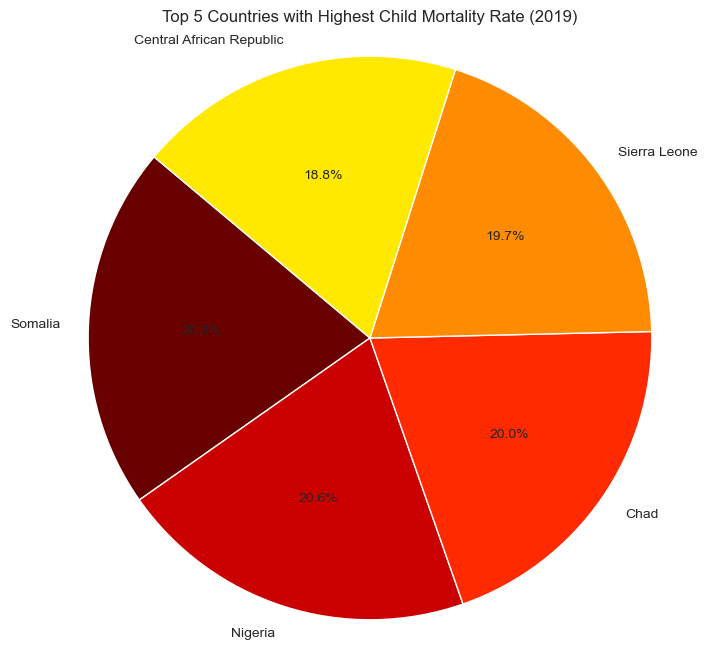

# Predicting under_5 mortality

**Business Understanding**:

Under-5 mortality, which represents not only the loss of young lives but also structural shortcomings in the healthcare system and access to
basic treatments, continues to be a major global health concern. The under-5 mortality rate still stands at 4.9 million fatalities globally
each year, with a disproportionately high burden in low- and middle-income nations, despite significant progress since 2000. Notably,
many of the causes of under-five mortality, such as infectious diseases,malnutrition, and inadequate maternal healthcare, are preventable and treatable with cost-effective interventions. This discrepancy emphasizes how urgent it is to allocate resources and implement focused initiatives to address the underlying causes of childhood mortality. In order to better prioritize interventions and allocate resources for optimum impact, this project seeks to identify high-risk categories for under-5 mortality based on age and cause of death.

**Problem statement**

The under-5 mortality rate has decreased significantly over the last 20 years, but there is still a high rate of childhood deaths, especially in low- and middle-income nations. This emphasizes the need for more focused and efficient treatments. In order to address this pressing public health issue and support the global endeavor to guarantee that every child has the chance to survive and thrive, this project aims to identify high-risk categories for under-5 mortality and develop strategies to prioritize interventions and optimize resource allocation.

**Objectives:**

Main objective

To contribute to the reduction of child mortality rates by identifying high-risk populations, classifying mortality risk levels, and analyzing temporal trends.

Specific objective

1.To identify populations at high risk of child mortality based on demographic and health-related factors.

2.To classify mortality risk levels for children based on cause-specific data.

3.To analyze temporal trends in child mortality rates and forecast future mortality rates.

**Data understanding**

The project uses the following data set compiled from Kaggle and web-scarpped data. Each dataset records the country name as Entity and code as country code with
various columns as highlighted below between 1990 to 2019.

1.causes_death.csv: Records 29 causes of death for each country for each year under review.

2.Per_capita_total_expenditure_on_health_vs_child_mortality.csv:contains mortality rate, under-5 (per 1,000 live births), Current health
expenditure per capita and population.

3.mortality_rates_sexes.csv: Records mortality rate, under-5 (per1,000 live births) per gender i.e. male and female

4.deaths_ages.csv: contains number of deaths in different groups between 0 days to 4 years. i.e. 0-6 days,7-27 days,28-364 days,1-4 years.

5.gdp_csv: Contains the gross domestic products for each country between 1990 to 2020

**Exploratory Data Analysis (EDA):** understanding the distribution of data, and exploring relationships between variables.

-   Determining the regions and countries with the most current highest and lowest mortality rates.

-   Top Ten Causes of Death in Children Under 5.

-   Gender with the Highest Recorded Under 5 Mortality Rate.

-   Total Number of Under 5 Deaths Across the Various Age Groups Between 1990 and 2019.

-   Year with the Highest Recorded Under 5 Mortality Rate.

**Modelling**

**K-means clustering:**

visualize and determine the optimal number of clusters for K-means clustering using the elbow method, based on the principal components of
the dataset. Used the silhouette analysis technique to determine the optimal number of clusters. We obtained 3 clusters. From that, we were
able to group the countries into three clusters, with cluster 0 including a greater number of countries than the other clusters.

Distribution of mortality rates on the clusters is as shown below: 

Clusters 1 and 2 had high values in the mortality indicators as well as a higher number of death cases resulting from the various risk factors. We defined cluster 1 and 2 as high-risk clusters and cluster 0 as low
risk clusters.

**Classification models:**

evaluates performance using various metrics, and provides insights into how well the model is performing in terms of predicting the mortality risk categories. Feature importance is done to understand which features are most influential in predicting the mortality risk categories.

Models used are: Logistics regression model, Support Vector model,Random Forest classifier and Naive Bayes.

Model evaluation: classification model evaluates its performance using cross-validation, and provides an estimate of its accuracy on unseen test data.

The Naive Bayes model was chosen as the best model as it had the most optimisitc performance with a training and test accuracy that are neither perfect not too low.

The most important features in predicting the risk of under 5 mortality include from the models used are:

1.  Number of deaths in 28-264 days olds (infant mortality)

2.  Number of deaths in 7-27 days olds (late neonatal mortality)

3.  Number of deaths in 0-6 days olds (early neonatal mortality)

4.  Perinatal conditions for example Neonatal preterm birth,Neonatal sepsis and other neonatal infections, Neonatal encephalopathy due to
    birth asphyxia and trauma, and Congenital birth defects

5.  Chronic diseases including: Neoplasms, Cirrhosis and other chronic liver diseases\', kidney diseases, cardiovascular diseases and
    diabetes mellitus

6.  External causes such as drowning, heat and fire injuries, violence and natural disasters

7.  Infectious and communicable diseases for example meningitis,malaria, diarrheal diseases among others

8.  Digestive system diseases

**Time series:**

show the mortality trends and forecast future mortality rates. There is observed decrease in the mortality rates across different countries over the observed period (1990-2020). The countries with the highest mortality rates were as shown below:

From Dickey-fuller test to analyze the stationarity of mortality rate for different countries, it showed that the data was not stationary hence proceeded to do differencing to achieve stationarity. The data remains non-stationary even after order 4 differencing hence to use only one model for all the datasets, one can opt for SARIMA

The model evaluation is done by using diagnostics plots (ACF and PCF) to provide insights on the seasonal orders p,d,q and criteria like AIC. Performed a stepwise search to find the best ARIMA models for multiple datasets. Each model is evaluated based on its AIC value, with lower AIC values indicating a better fit.

**Recommendation and conclusion**

**Next steps**

**Deployment**

**Usage Guide**

 **Clone the Repository**: Start by cloning this repository to your local machine.

Bash Copy code git clone https://github.com/sammaash/mortality.

**Download the Dataset**: Download the dataset from
 <https://github.com/sammaash/mortality> and place it in the data directory of the repository.

> **Run the notebook codes and explore the recommendations References**
