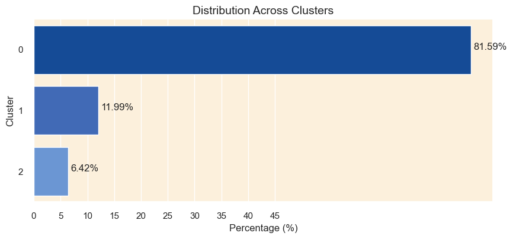

# Predicting under_5 mortality

### Business Understanding

Under-5 mortality, which represents not only the loss of young lives but also structural shortcomings in the healthcare system and access to
basic treatments, continues to be a major global health concern. The under-5 mortality rate still stands at 4.9 million fatalities globally
each year, with a disproportionately high burden in low- and middle-income nations, despite significant progress since 2000. This discrepancy emphasizes how urgent it is to allocate resources and implement focused initiatives to address the underlying causes of
childhood mortality. In order to better prioritize interventions and allocate resources for optimum impact, this project seeks to identify
high-risk categories for under-5 mortality based on age and cause of death.

### Problem statement

The under-5 mortality rate has decreased significantly over the last 20 years, but there is still a high rate of childhood deaths, especially in low- and middle-income nations. This emphasizes the need for more focused and efficient treatments. In order to address this pressing public health issue and support the global endeavor to guarantee that every child has the chance to survive and thrive, this project aims to identify high-risk categories for under-5 mortality and develop strategies to prioritize interventions and optimize resource allocation.

### Objectives:

1.Determine High-Risk Groups: Examine data to identify contextual and demographic elements linked to an increased risk of under-5 mortality,
paying particular attention to cause of death.

2.Identify primary causes of death, interpret and predict future trends in under-5 mortality rates.

3.Enlighten Practice and Policy: Provide analysis and suggestions to guide clinical practice and evidence-based policy-making with the goal
of lowering the under-5 death rate and advancing universal access to healthcare services.

### Data understanding

The project uses the following data set compiled from Kaggle. Each dataset records the country name as Entity and code as country code with
various columns as highlighted below between 1990 to 2019.

1.causes_death.csv: Records 29 causes of death for each country for each year under review.

2.Per_capita_total_expenditure_on_health_vs_child_mortality.csv: contains mortality rate, under-5 (per 1,000 live births), Current health expenditure per capita and population.

3.mortality_rates_sexes.csv: Records mortality rate, under-5 (per1,000 live births) per gender i.e. male and female

4.deaths_ages.csv: contains number of deaths in different groups between 0 days to 4 years.

5.gdp_csv: Contains the gross domestic products for each country between 1990 to 2020

The dataset was explored, cleaned and preprocessed to discern which ones most accurately predict under 5 mortality rate.

### Modelling

#### K-means clustering:
visualize and determine the optimal number of clusters for K-means clustering using the elbow method, based on the
principal components of the dataset. Used the silhouette analysis technique to determine the optimal number of clusters. We obtained 3 clusters. From that, we were able to group the countries into three clusters, with cluster 1 including a greater number of countries than
the other clusters.

Distribution of mortality rates on the clusters is as shown below:

#### Logistic regression model:
evaluates performance using various metrics, and provides insights into how well the model is performing in
terms of predicting the mortality risk categories. Feature importance is done to understand which features are most influential in predicting the mortality risk categories

#### Time series:
show the mortality trends and forecast future mortality rates.There is observed decrease in the mortality rates accross different countries over the observed period(1990-2020).The countries with the highest mortality rates were as shown below:

From Dickey-fuller test to analyze the stationarity of mortality rate for different countries,it showed that the data was not stationary hence proceeded to do differencing  to achieve stationarity.

### Recommendation and conclusion

### Next steps

### Deployment
